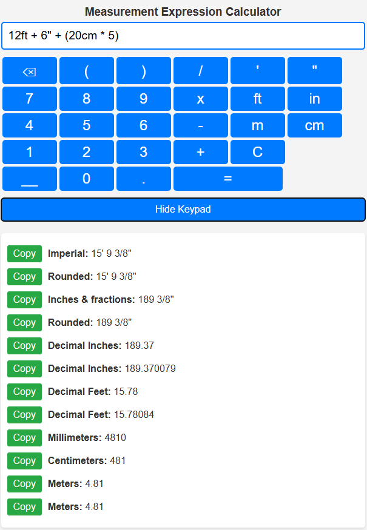

# Inch Calculator

This is a custom calculator for measurements, including feet and inches, with a simplified numeric keypad for easy input on mobile devices.

## Inner Workings

- **Custom Keypad**: A numeric keypad is provided to simplify input on mobile devices, especially for measurements involving inches and feet.
- **Measurement Parsing**: The page uses a combination of JavaScript and regex to parse measurement expressions, allowing users to input values like `1' 2 5/8"`. 
- **Expression Evaluation** The expression is evaluated via an API call to the www.inchcalculator.com service that return a JSON result for presentation. Some cleansing is done before presentation of the results.
- **Rounding**: The `roundFraction` function rounds fractional values to common construction-friendly values such as `1/8`, `1/4`, and `1/2`. This ensures that measurements are presented in a practical format.

## Adding a Shortcut to Your Home Screen (iPhone)

To add the calculator to your iPhone home screen for easy access:

1. Open Safari on your iPhone.
2. Navigate to the calculator GitHub Pages URL: [https://onleserkey.github.io/inchcalculator](https://onleserkey.github.io/inchcalculator).
3. Tap the **Share** button at the bottom of the screen (the icon with an upward arrow).
4. Scroll down and tap **Add to Home Screen**.
5. Edit the name if you like, then tap **Add**.

The calculator will now appear on your home screen like an app.

API Copyright www.inchcalculator.com
Credi for regex expression - https://regexlib.com/REDetails.aspx?regexp_id=2127
